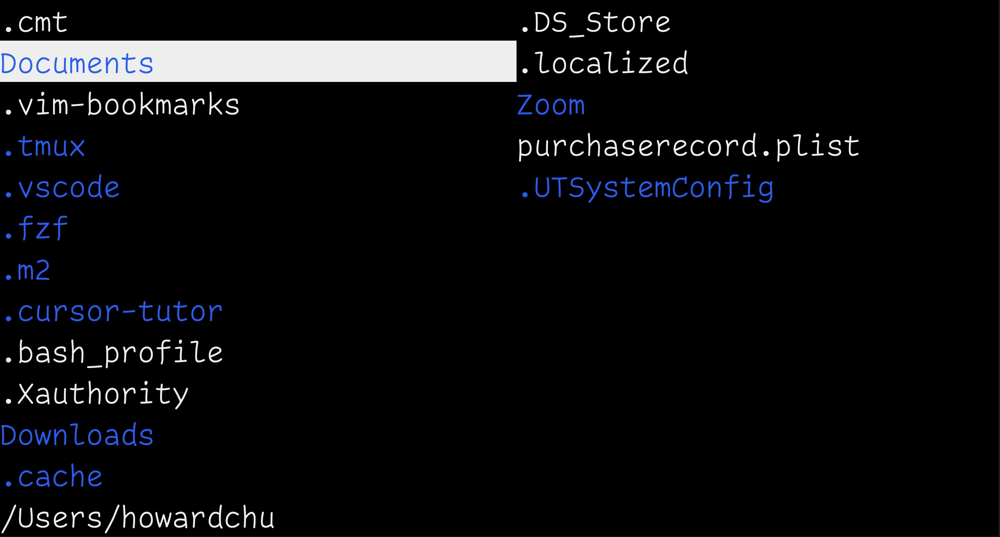

### Config file

located at

```bash
~/.tsrc
```

**if `~/.tsrc` doesn't exist, you need to create one**

It supports changing the editor (opened with `o` or `ENTER`) and the theme.

An example of `~/.tsrc`:

```tsrc
# Set your preferred editor
editor = emacs

# 'open = ' has the same effect as 'editor = '
open = emacs

# Set your preferred theme
theme = dark
```

Because `o` and `ENTER` can both open files, you can specify their commands separately.
```tsrc
# The line below will be overridden by the following lines
editor = code

# Command to run after pressing 'o', this overrides 'editor = ' and 'open = '
o = open

# Command to run after pressing 'enter', this overrides 'editor = ' and 'open = '
enter = vim
```

Command line arguments are supported as well.
```tsrc
# Option value with whitespace, such as '--title "I Love Emacs"' is not supported yet
enter = emacs -nbc --no-desktop --title I-Love-Emacs
o = code --sync on --disable-lcd-text --disable-gpu
```

### Theme

The default theme is `lucius`.

`dark` theme:



Other themes:

* [catppuccin](https://imgur.com/a/mK2Toin)
* [trans](https://imgur.com/a/m4dmLig)
* [lucius](https://github.com/jonathanfilip/lucius)
* [acme](https://github.com/ianyepan/acme-emacs-theme)
* [sakura](https://imgur.com/a/5YhgVMG)
* [vscode](https://github.com/Mofiqul/vscode.nvim)
* [jesus](https://imgur.com/a/creZltw)
* [lucius-l](https://imgur.com/a/RyImZYW)

The theme name is case-insensitive; e.g., Catppuccin and catppuccin both work.

### Editor

The specified editor will open when `o` or `ENTER` is pressed while the cursor is on a
file.

The default editor is `vi`; You can change it to `vscode` by adding this line into your
`~/.tsrc` file:
```tsrc
editor = code
```

`o` and `ENTER` can open different editors and programs, for example, press `o` to open `vim`,
and `enter` to open `emacs`. See the guide above for how to configure them using `.tsrc`.
